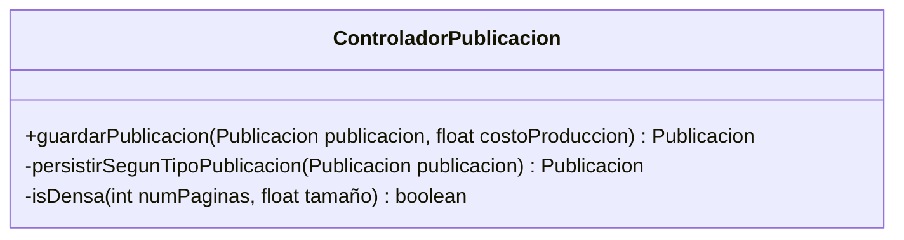

# Diagrama de Clase: org.itson.controladores

```mermaid
classDiagram

class ControladorPublicacion{
    +guardarPublicacion(Publicacion publicacion, float costoProduccion) Publicacion
    -persistirSegunTipoPublicacion(Publicacion publicacion) Publicacion
    -isDensa(int numPaginas, float tamaño) boolean
}
```