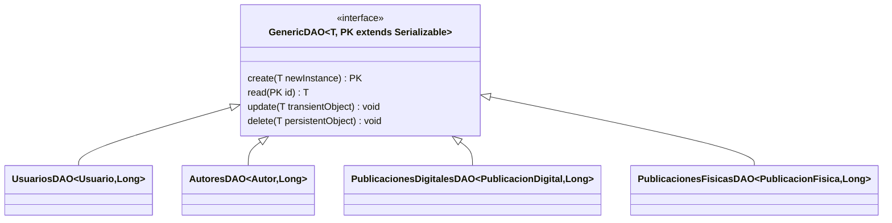

# Diagrama de Clase: org.itson.daos

```mermaid
classDiagram


class GenericDAO ~T, PK extends Serializable~ {
    create(T newInstance) PK
    read(PK id) T
    update(T transientObject) void
    delete(T persistentObject) void
}

class UsuariosDAO ~Usuario,Long~ 

class AutoresDAO ~Autor,Long~

class PublicacionesDigitalesDAO ~PublicacionDigital,Long~

class PublicacionesFisicasDAO ~PublicacionFisica,Long~


GenericDAO  <|-- UsuariosDAO
GenericDAO  <|-- AutoresDAO
GenericDAO  <|-- PublicacionesDigitalesDAO 
GenericDAO  <|-- PublicacionesFisicasDAO 
<<interface>> GenericDAO
```