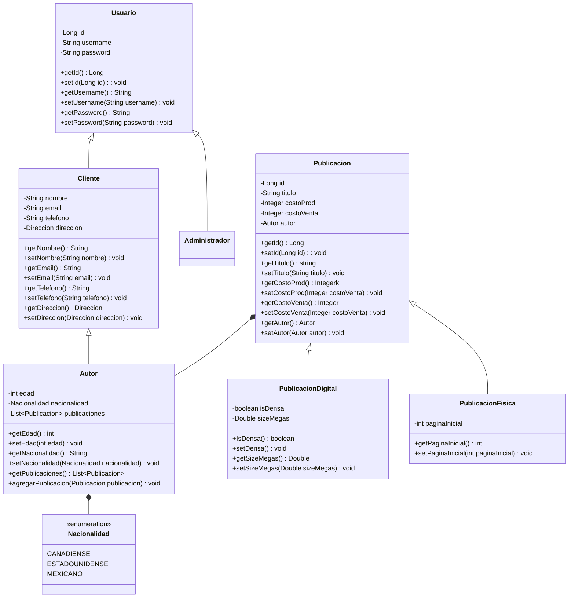

# Diagrama de Clase: org.itson.dominio

---
### Notas
`Nacionalidad` se manejará como un enumerador, ya que es una aplicación pequeña, pero sería mejor usar algún XML/JSON que contenga todas las nacionalidades y solo cargarlas al iniciar la aplicación, generando algún tipo de caché para evitar cargar cada que se abre.
