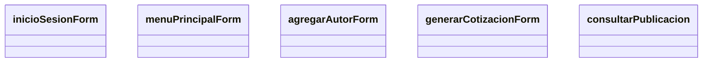

# Diagrama de Clase: org.itson.presentacion

### Notas
1. agregarAutorForm tendrá diseño dinámico, abarcando agregar y modificar
2. consultarPublicacion está pendiente  de saber si se va a agregar o no

       