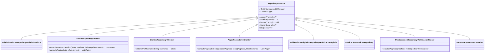

# Diagrama de Clase: org.itson.repositories

```mermaid
classDiagram

class RepositoryBase ~T~ {
    # EntityManager entityManager
    - Class~T~ type;

    agregar(T entity): T
    actualizar(T entity): T
    eliminar(T entity): void
    obtener(Long id): T

    lista(): List~T~
}

class AdministradoresRepository ~Administrador~ 

class AutoresRepository ~Autor~{
    +consultaNombreYApellido(String nombres, String apellidoPaterno): List~Autor~
    +consultaPaginado(int offset, int limit): List~Autor~
}

class ClientesRepository ~Cliente~{
    +obtenerPorUsername(String username): Cliente
}

class PagosRepository ~Cliente~{
    +consultaPaginado(ConfiguracionPaginado configPaginado, Cliente cliente): List~Pago~
}


class PublicacionesDigitalesRepository ~PublicacionDigital~

class PublicacionesRepository ~PublicacionFisica~{
        +consultaPaginado(int offset, int limit): List~Publicacion~
}

class UsuariosRepository ~Usuario~

RepositoryBase  <|-- AdministradoresRepository
RepositoryBase  <|-- AutoresRepository
RepositoryBase  <|-- ClientesRepository
RepositoryBase  <|-- PagosRepository
RepositoryBase  <|-- PublicacionesDigitalesRepository 
RepositoryBase  <|-- PublicacionesFisicasRepository 
RepositoryBase  <|-- PublicacionesRepository 
RepositoryBase  <|-- UsuariosRepository

```