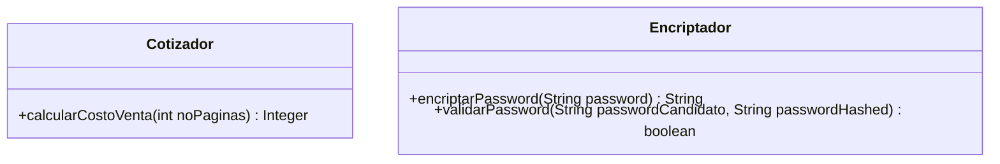

# Diagrama de Clase: org.itson.utils

```mermaid
classDiagram

class Cotizador{
    +calcularCostoVenta(int noPaginas) Integer
}

class Encriptador{
    +encriptarPassword(String password) String
    +validarPassword(String passwordCandidato, String passwordHashed) boolean
}
```