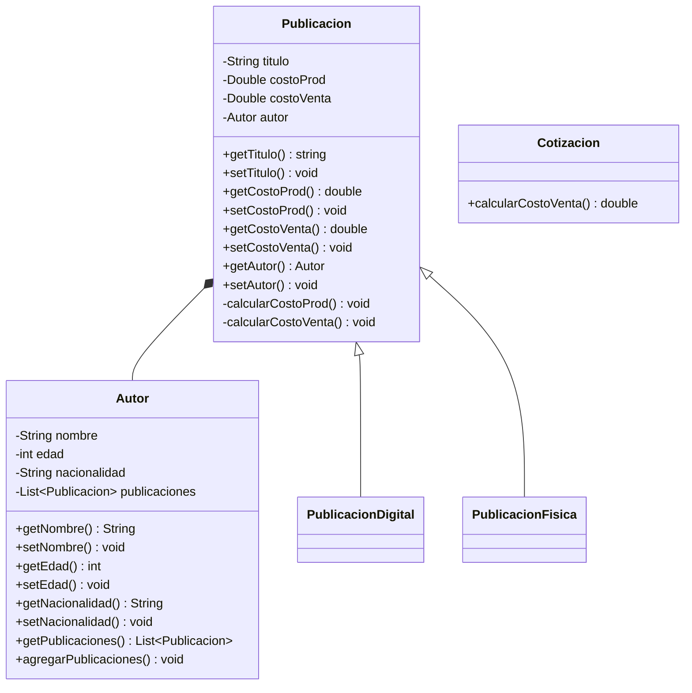

# Diagramas de Clase

```mermaid
classDiagram

    Publicacion *-- Autor
    Publicacion <|-- PublicacionDigital
    Publicacion <|-- PublicacionFisica

    class Autor
    Autor : -String nombre
    Autor : -int edad
    Autor : -String nacionalidad
    Autor : -List~Publicacion~ publicaciones

    Autor : +getNombre() String
    Autor : +setNombre() void
    Autor : +getEdad() int
    Autor : +setEdad() void
    Autor : +getNacionalidad() String
    Autor : +setNacionalidad() void
    Autor : +getPublicaciones() List~Publicacion~

    Autor : +agregarPublicaciones() void


    class Publicacion
    Publicacion : -String titulo
    Publicacion : -Double costoProd
    Publicacion : -Double costoVenta
    Publicacion : -Autor autor

    Publicacion : +getTitulo() string
    Publicacion : +setTitulo() void
    Publicacion : +getCostoProd() double
    Publicacion : +setCostoProd() void
    Publicacion : +getCostoVenta() double
    Publicacion : +setCostoVenta() void
    Publicacion : +getAutor() Autor
    Publicacion : +setAutor() void

    Publicacion : -calcularCostoProd() void
    Publicacion : -calcularCostoVenta() void

    class PublicacionFisica
    class PublicacionDigital

    class Cotizacion
    Cotizacion : +calcularCostoVenta() double
```

