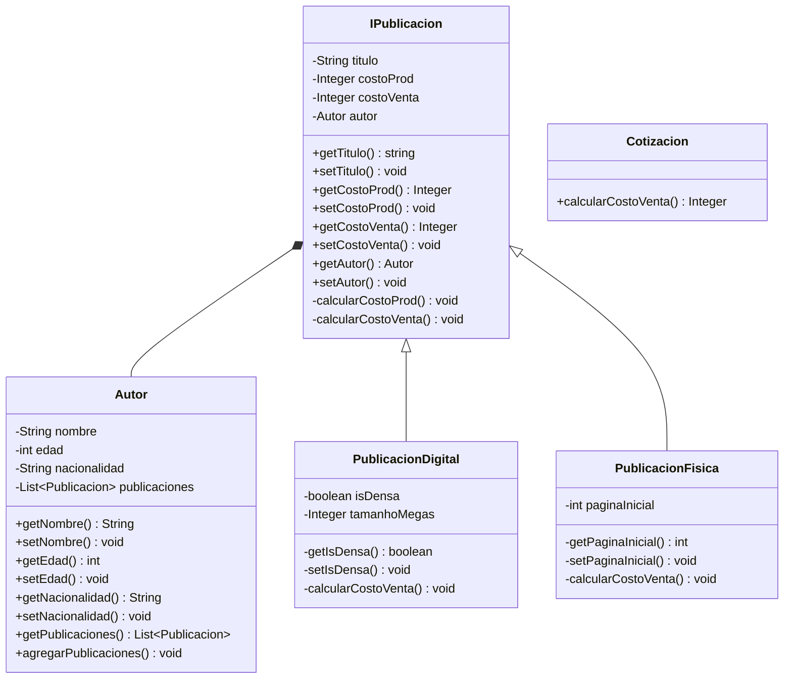

# Diagramas de Clase

```mermaid
classDiagram

    IPublicacion *-- Autor
    IPublicacion <|-- PublicacionDigital
    IPublicacion <|-- PublicacionFisica

    class Autor
    Autor : -String nombre
    Autor : -int edad
    Autor : -String nacionalidad
    Autor : -List~Publicacion~ publicaciones

    Autor : +getNombre() String
    Autor : +setNombre() void
    Autor : +getEdad() int
    Autor : +setEdad() void
    Autor : +getNacionalidad() String
    Autor : +setNacionalidad() void
    Autor : +getPublicaciones() List~Publicacion~

    Autor : +agregarPublicaciones() void


    class IPublicacion
    IPublicacion : -String titulo
    IPublicacion : -Integer costoProd
    IPublicacion : -Integer costoVenta
    IPublicacion : -Autor autor

    IPublicacion : +getTitulo() string
    IPublicacion : +setTitulo() void
    IPublicacion : +getCostoProd() Integer
    IPublicacion : +setCostoProd() void
    IPublicacion : +getCostoVenta() Integer
    IPublicacion : +setCostoVenta() void
    IPublicacion : +getAutor() Autor
    IPublicacion : +setAutor() void

    IPublicacion : -calcularCostoProd() void
    IPublicacion : -calcularCostoVenta() void

    class PublicacionFisica
    PublicacionFisica : -int paginaInicial

    PublicacionFisica : -getPaginaInicial() int
    PublicacionFisica : -setPaginaInicial() void
    PublicacionFisica : -calcularCostoVenta() void

    class PublicacionDigital
    PublicacionDigital : -boolean isDensa
    PublicacionDigital : -Integer tamanhoMegas
    
    PublicacionDigital : -getIsDensa() boolean
    PublicacionDigital : -setIsDensa() void
    PublicacionDigital : -calcularCostoVenta() void


    class Cotizacion
    Cotizacion : +calcularCostoVenta() Integer
```

