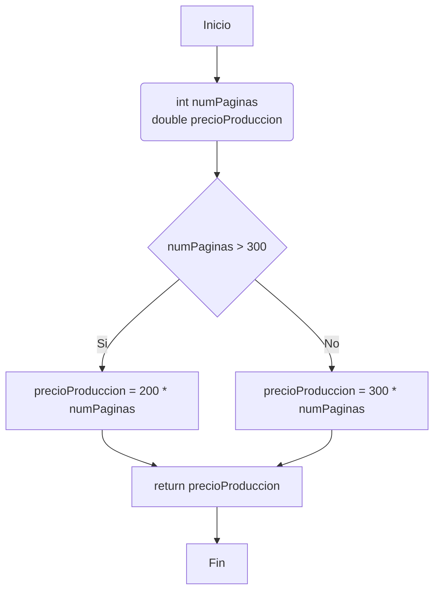
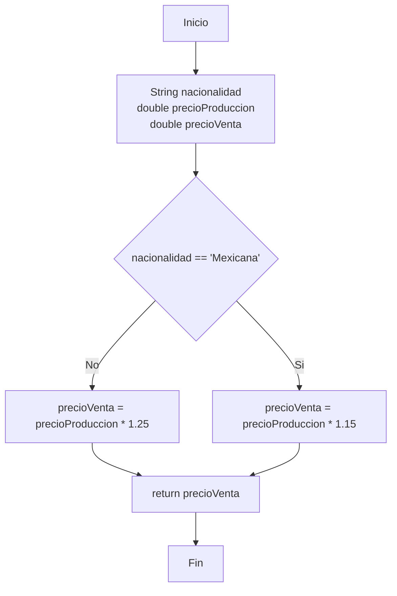
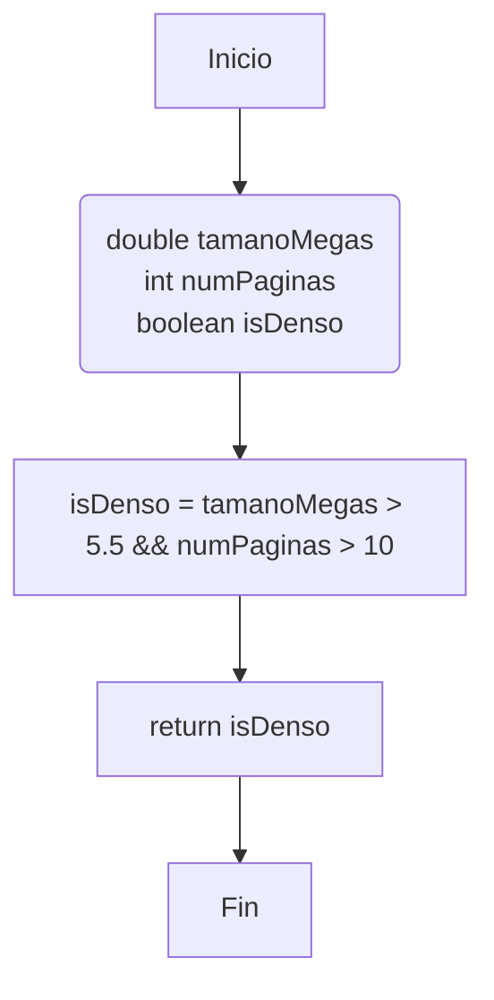
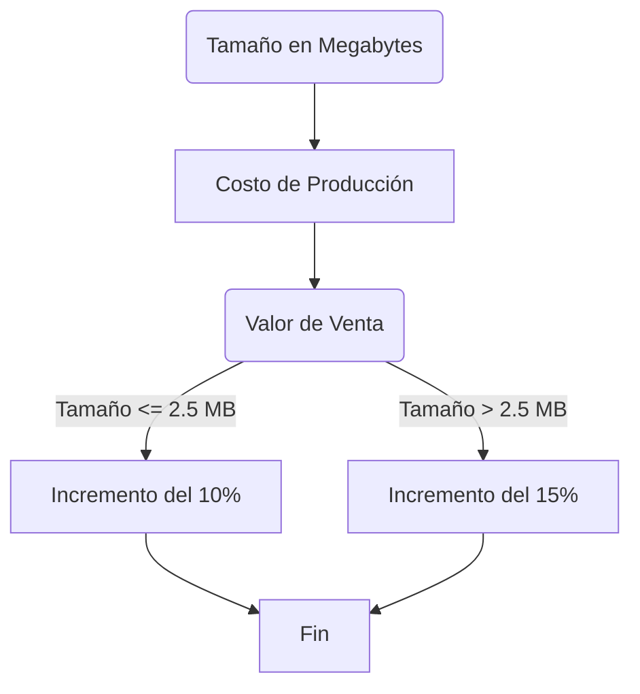

# Flowchart

## Costo Producción

```mermaid
flowchart TD
    I[Inicio] --> A
    A( int numPaginas\n double precioProduccion ) --> B{numPaginas > 300}
    B -->|Si| C[precioProduccion = 200 * numPaginas]
    B --> |No| D[precioProduccion = 300 * numPaginas]
    C --> E[return precioProduccion]
    D --> E[return precioProduccion]
    E --> F[Fin]
```
---

## Costo Venta

```mermaid
flowchart TD
A[Inicio] --> B[String nacionalidad \n double precioProduccion \n double precioVenta]
B --> C{nacionalidad == 'Mexicana'}
C -->|Si| D[precioVenta = precioProduccion * 1.15]
C -->|No| E[precioVenta = precioProduccion * 1.25]
E --> F[return precioVenta]
D --> F[return precioVenta]
F --> G[Fin]
```
---
## Calcular densidad

```mermaid
flowchart TD

A[Inicio] --> B;
B(double tamanoMegas \n int numPaginas\n boolean isDenso) ;
B --> C[isDenso = tamanoMegas > 5.5 && numPaginas > 10];
C --> D;
D[return isDenso] --> E[Fin];
```
--- 
### Calcular aumento de precio de produccion segun el tamaño

``` mermaid
flowchart TD
A(Tamaño en Megabytes);

A --> F[Costo de Producción];
F --> G(Valor de Venta);
G -- Tamaño <= 2.5 MB --> H[Incremento del 10%];
G -- Tamaño > 2.5 MB --> I[Incremento del 15%];
H --> J[Fin]
I --> J
```